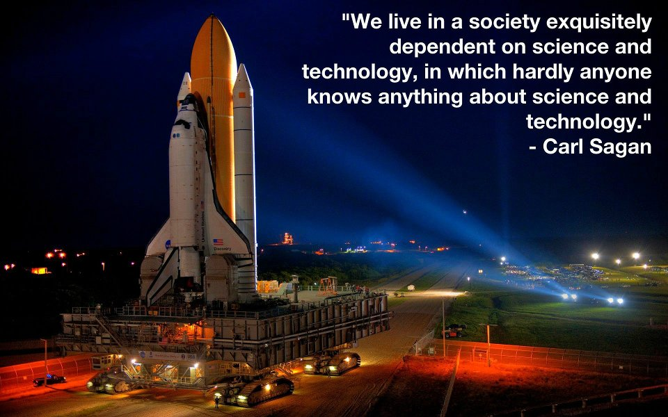

# Part 1: What is Science? {#what-is}

:::{.centerpic}
{width=70%}
:::

**_Some 2400 years ago_** the Greek philosopher Aristotle defined human beings as "the rational animal." Since he was someone who spent his life carefully investigating the world around him and laying the foundations for scientific inquiry we can forgive him for being a little optimistic in this definition. It might be better to revise his definition slightly and refer to ourselves as *storytelling animals* instead. We come into the world equipped with a brain and central nervous system that function as a story telling machine that takes in enormous amounts of information and spontaneously generates stories about what is happening around us, as well as predictions about what will happen next, and plans about how we might influence what is happening to our advantage. Some of these stories it turns out reflect what is really going in around us, but many do not, reflecting instead what we imagine or would like to be happening instead. And in fact, even if Aristotle can lay claim to having laid the foundations for science, it really wasn't until the developments of the scientific revolution 1500 years *after* his death that science really took off. Ironically, it was Aristotle's own theories about the nature of reality and the essential components of rational scientific explanation itself that had to be rejected to really begin developing a successful account of reality and its workings.

**_Science is nothing but_** a systematic and deliberate effort to distinguish between the stories that reflect the true nature of things and those that do not. It is a way of distinguishing bewteen appearances and reality to put it somewhat dramatically. This course, and the material collected here, is intended as an extended reflection on the way science works, the tools it employs, some important episodes from the history of science, and some of the many ways in which we get lost on our way to knowledge owing to the inner workings of our spontaneous story-telling machines. It tells the story of the origins of science and its methods, and how it might be distinguished from the "undergroth of science" or the almost but not quite scientific accounts that have accompanied the quest for knowledge from the beginning.

