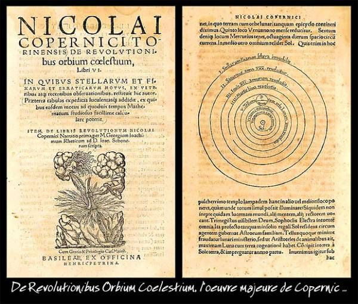
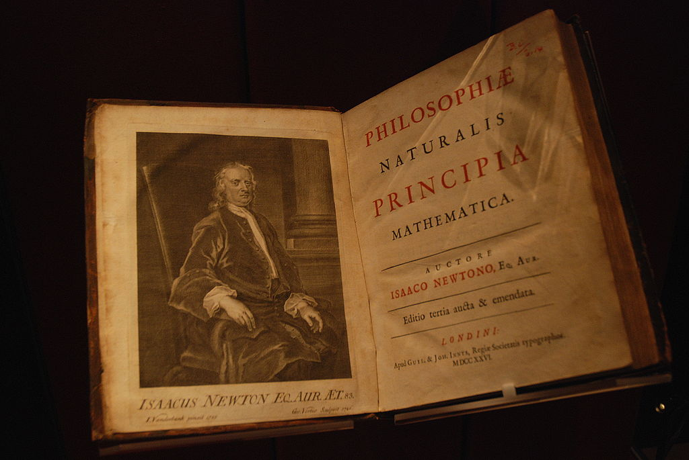

## The scientific revolution {#revolution}

The scientific revolution was a far-reaching transformation of our understanding of the natural world as well as a transformation of the methods we could use to gather knowledge about the world. It can be conveniently framed by the publication of two books, even if its roots go further back that the first and it continued long after the second. The first of these is *On the revolutions of the Heavenly Spheres* written by Nicolas Copernicus and published shortly after his death in 1543.

:::{.centerpic  data-latex=""}

{width=60%} \

:::

And the second is Isaac Newton's *Mathematical Principles of Natural Philosophy* first published in 1687.

:::{.centerpic data-latex=""}

{width=60%} \

:::

:::{.centercap data-latex=""}

Paul Hermans [<a href="https://creativecommons.org/licenses/by-sa/3.0">CC BY-SA 3.0</a>], <a href="https://commons.wikimedia.org/wiki/File:Manchester_John_Rylands_Library_Isaac_Newton_16-10-2009_13-54-26.JPG">via Wikimedia Commons</a>
:::

The first of these presented a clear and deliberate argument against the view that the earth is the stable center of the universe with the sun the planets and the stars all orbiting around us. The second articulated a simple set of mathematical laws governing all motion on earth and in the heavens. It made use of the novel mathematical techniques and principles now known as calculus to describe with mathematical precision the continuous change of variables in such phenomena as the orbits of the planets and the motion of projectiles here in earth.

These two books represent convenient beginning and end points for a series of developments that transformed our conception of the universe and our place in it. The image below has embedded within it videos and web links to find out more about Copernicus, Newton and many of the other important contributors whose lives and work unfolded between these two.

:::{.centerpic data-latex=""}

:::