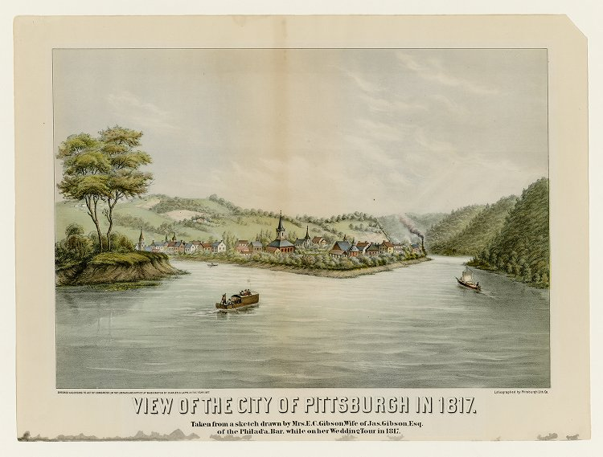
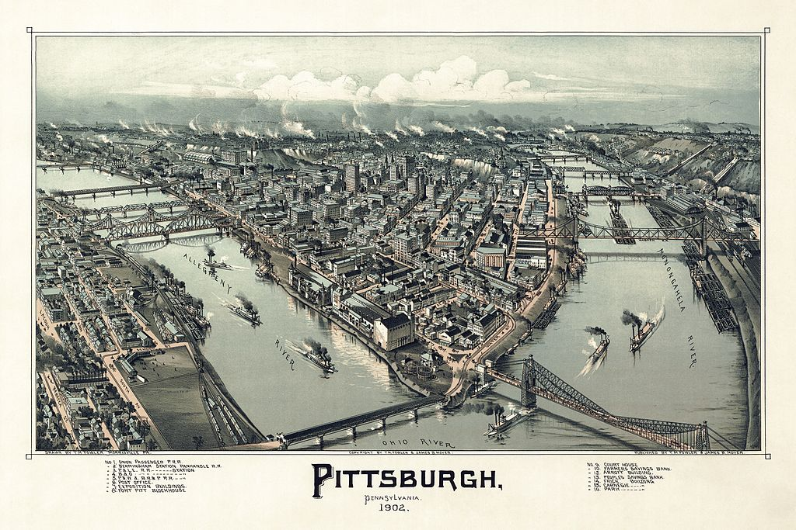

## Matter and energy

In the beginning of the Nineteenth Century, that is *after* the Scientific Revolution, the scientific understanding of the material world was just getting started. At that point the following questions had not yet been answered:

* What exactly are material things made of?
* What causes matter to change form -- why do things rust, burn, transform chemically?
* What explains the mysterious phenomena of electricity and magnetism?
* What is heat, why do some processes release heat and how can it be harnessed to do interesting things?
* What is the difference between animate and inanimate things?

By the end of the century all of these questions had been answered, even though the details had not yet all been worked out. But not only did this vast increase in knowledge lead to a great understanding of the material world, it was also accompanied by, led to and was helped out by a vast change in human society known as the Industrial Revolution. As compelling evidence of the scope of theses changes consider Pittsburgh, Pennsylvania at the beginning and at the end of the century. Before the scientific and technological changes of the Nineteenth Century Pittsburgh was a sleepy frontier town at the confluence of three rivers.

:::{.centerpic data-latex=""}

{width=60%} \

:::

:::{.centercap data-latex=""}

View of the City of Pittsburgh in 1817 by Mrs. E. C. Gibson & William Coventry Wall

:::

Less than a century later the small frontier town had grown into an industrial city at the heart of the American steel industry.

:::{.centerpic data-latex=""}

{width=60%} \

:::

:::{.centercap data-latex=""}

Pittsburgh in 1902 by Thaddeus Mortimer Fowler

:::

Underneath this transformation into the world of modern industrial society in which we still all live was a series of scientific developments in the understanding and hence ability to manipulate the material world as never before. 
